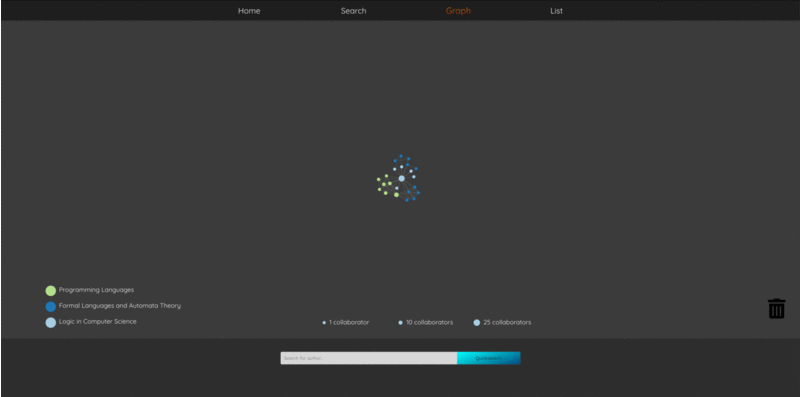

# arXplorer :pineapple: [](https://app.netlify.com/sites/arxplorer/deploys) [](http://commitizen.github.io/cz-cli/)

<p align="center">

</p>

## Introduction
**arXplorer** is a web-app for interatively exploring the large research body at arXiv.org. 

To get started, perform a search in the **Search** tab or in one of the **quicksearch** bars.

If search is successful you will be automatically redirected to the **graph** - here is where the arXploration begins! Hover over the author nodes to see their names and click any particular author and expand the graph from there!

When you find an author and wants to see their written articles in greater detail, click their name from the right panel, click any of their articles or click the **List** tab to navigate there. If you find a paper that interests you, click the link to open the article on arXiv.org. 

Good luck and happy searching!

PS, have fun finding the hidden easter egg! :hatching_chick:

#### :link: Links :link:

https://arxplorer.com

https://arxiv.org/ and https://arxiv.org/help/api/

### :unicorn: Future plans :unicorn:
- Complete refactoring into TypeScript
- Add test coverage
- Add Google Analytics
- Widen search features and possibilities including larger and fuzzy searches

### :rocket: Getting started? :rocket:

Simply fork the repo and run the following commands to get started:

```javascript
npm i
npm start
```

### :books: Tech stack :books:
- [React](https://reactjs.org/)
- [D3](https://d3js.org/)

### :mag_right: Technical details :mag_right:

- Search queries:
  - Searches currently only return the first 25 results received from arXiv.org. This is a measure to prevent the graph from expanding too rapidly and cause performance issues. 
  - Searches currently search for a strict match, so search for "Dexter Kozen" will search for "Dexter" AND "Kozen" in one and not return fuzzy search results. Again because of performance considerations. 

## :man_technologist: Author :man_technologist:
Joachim Koch - [LinkedIn](https://www.linkedin.com/in/joachimvkoch/) - [Twitter](https://twitter.com/JokkeKochs)

